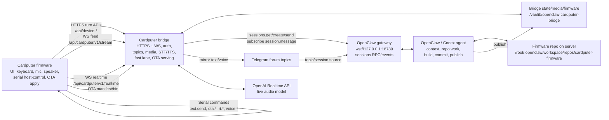

# Cardputer Server Routing Architecture

Date: 2026-05-03.

This document describes the current server-side routing for Cardputer text, standard voice, realtime voice, device commands, topics, and OTA/firmware work.

## Principle

The bridge is intentionally thin.

- The Cardputer firmware owns hardware UX, serial host-control commands, audio capture/playback, topic UI, and OTA apply.
- The Cardputer bridge owns authentication, topic/session mapping, media storage, STT/TTS glue, low-latency responses, realtime proxying, firmware manifest/file serving, and transport reliability.
- OpenClaw owns long-running intelligence: normal topic context, Codex/OpenCode execution, repository work, commits, firmware builds, and OTA publishing.
- Telegram forum topics map to OpenClaw sessions. The bridge stores enough local state to replay history, sync topics, and serve the device even when a turn is asynchronous.

Do not move firmware development logic into the bridge. Firmware work should be routed to OpenClaw/Codex with enough repo/runbook context; the bridge should remain transport/context/OTA distribution.

## Live Processes

On `cnt-openclaw`:

- `openclaw-cardputer-bridge.service`
  - Node bridge from `/opt/openclaw-cardputer-bridge/src/server.mjs`.
  - Listens on `0.0.0.0:31889`.
  - Public route is `https://bridge.ai.k-digital.pro`.
  - Runtime state is under `/var/lib/openclaw-cardputer-bridge`.
- `openclaw-gateway.service`
  - OpenClaw upstream gateway.
  - Listens on `127.0.0.1:18789`.
  - The bridge talks to it over WebSocket RPC at `ws://127.0.0.1:18789`.
- OpenClaw embedded agent / Codex executor
  - Runs behind the upstream gateway.
  - Handles `sessions.send`, normal assistant replies, repository edits, build/publish jobs, and topic history.

Runtime state owned by the bridge:

- `/var/lib/openclaw-cardputer-bridge/state.json`
  - devices, topics, messages, media metadata, idempotency, read state.
- `/var/lib/openclaw-cardputer-bridge/media/*`
  - canonical and playback voice assets.
- `/var/lib/openclaw-cardputer-bridge/firmware/cardputer_adv/manifest.json`
  - current OTA manifest.
- `/var/lib/openclaw-cardputer-bridge/firmware/cardputer_adv/cardputer-adv-*.bin`
  - OTA binaries served to the device.

## High-Level Diagram



## Topics And Sessions

Each Telegram forum topic has a stable bridge topic key and OpenClaw session key.

- Bridge topic key: `tg:root-main:default:<chat_id>:<thread_id>`.
- OpenClaw session key: `agent:main:telegram:group:<chat_id>:topic:<thread_id>`.
- The selected device topic is global for chat, pulse, standard voice, realtime voice, inbox, and topic history.

Bridge responsibilities:

- create/select/list topics for the device;
- sync recent Telegram/OpenClaw sessions;
- subscribe to upstream `session.message` events;
- ingest assistant messages back into local bridge state;
- broadcast new messages to connected device feeds.

Device-facing topic APIs:

- `GET /api/cardputer/v1/topics`
- `POST /api/cardputer/v1/topics/create`
- `POST /api/cardputer/v1/topics/:topic_key/select`
- `GET /api/cardputer/v1/topics/:topic_key/history`
- `GET /api/cardputer/v1/topics/:topic_key/inbox/latest`
- `POST /api/cardputer/v1/topics/:topic_key/inbox/inject`

## Text Turn Routing

Primary endpoint:

- `POST /api/device-text-turn`

Flow:

1. Device sends text, device token, `x-conversation-key`, and `x-client-msg-id`.
2. Bridge validates device token and resolves the selected topic.
3. Bridge first checks local bridge commands such as `/topics`, `/topic`, `/next`, `/prev`.
4. Bridge calls `tryFastLaneTurn()`.
5. For normal text, fast lane:
   - stores the device message locally;
   - sends an enriched `sessions.send` to OpenClaw asynchronously;
   - asks the configured low-latency model for a compact immediate reply;
   - stores/broadcasts that reply locally.
6. If fast lane is disabled or fails with fallback enabled, bridge waits for an OpenClaw assistant reply from the upstream session.
7. Bridge returns a turn response to the device with visible text, optional reply audio, and any `device_actions`.

The enriched OpenClaw message includes:

- current topic metadata;
- optional topic catalog;
- recent topic history;
- firmware capability context;
- device action marker rules;
- latency policy for text or voice.

## Firmware Request Routing

Firmware-like text is detected by `wantsFirmwareWork()`.

Examples:

- `Bump firmware version and publish OTA.`
- `Добавь калькулятор в прошивку.`
- `Прошивка готова, опубликуй OTA.`

Current route:

1. Bridge recognizes the request as firmware work.
2. Bridge routes it to the dedicated `Cardputer Firmware` topic/session, not to the currently selected user topic.
3. Bridge immediately replies to the device that the request was accepted and routed.
4. OpenClaw/Codex in that clean session performs the actual repo work.
5. OpenClaw/Codex builds with the Cardputer wrapper, commits, pushes, publishes OTA, and reports the candidate version in the firmware topic.
6. Device later checks `/api/cardputer/firmware/manifest` and installs the OTA.

Important constraints passed in firmware context:

- Live server repo: `/root/.openclaw/workspace/repos/cardputer-firmware`.
- Live server build wrapper: `/root/.openclaw/workspace/bin/cardputer_adv_pio.sh`.
- Live publish wrapper: `/root/.openclaw/workspace/bin/cardputer_publish_firmware.sh`.
- Use exactly one firmware build at a time.
- Do not run parallel PlatformIO builds against the same `CardputerADV/.pio/build`.

Current validated evidence:

- Device request routed to `Cardputer Firmware`.
- OpenClaw/Codex published OTA `0.2.68-dev`.
- Firmware commit: `599c6ab`.
- Device installed and confirmed `0.2.68-dev` from OTA.

## Standard Voice Turn Routing

Primary endpoint:

- `POST /api/device-audio-turn-raw`

This is the stable voice UX path. It is push-to-talk / record-then-send, not live duplex streaming.

Flow:

1. Device records PCM audio locally.
2. Device uploads raw PCM to `/api/device-audio-turn-raw`.
3. Bridge wraps PCM as WAV when needed.
4. Bridge transcribes the audio with `transcribeDeviceAudio()`.
5. Bridge routes the transcript through the same logic as text:
   - local command handling;
   - firmware request routing;
   - fast lane;
   - fallback to OpenClaw session wait.
6. Bridge returns:
   - `transcript`;
   - `reply` / `full_text` / `short_text`;
   - optional synthesized reply audio;
   - optional `device_actions`.
7. Device displays transcript/reply and plays returned audio when requested.

Older/adjacent voice endpoint:

- `POST /api/cardputer/v1/topics/:topic_key/voice`

That route stores a voice note, transcodes it to canonical/playback formats, optionally transcribes, forwards the text or placeholder into OpenClaw, and mirrors the voice to Telegram. It is a message-storage route, not the main immediate assistant voice-turn route.

## Realtime Voice Routing

Primary WebSocket endpoint:

- `wss://bridge.ai.k-digital.pro/api/cardputer/v1/realtime`

Realtime is a separate mode from standard voice. It does not wait for OpenClaw/Codex to produce each reply. The bridge acts as a realtime audio proxy to the OpenAI Realtime API.

Connect flow:

1. Device opens `/api/cardputer/v1/realtime`.
2. Device sends a `connect` frame with `device_id`, `device_token`, and `topic_key`.
3. Bridge validates the device and topic.
4. Bridge opens a model WebSocket to the OpenAI Realtime API.
5. Bridge sends `session.update` with:
   - realtime instructions;
   - current topic title;
   - device action marker rules;
   - firmware capability context;
   - server VAD settings;
   - audio input/output PCM format.
6. Bridge sends `realtime.ready` to the device.

During a realtime session:

- Device sends `audio.append` chunks.
- Device sends `audio.commit` when it wants to force a response.
- Realtime server VAD can also create a response after silence.
- Bridge forwards model `audio.delta` chunks to the device.
- Bridge forwards transcript/text events to the device.
- Bridge forwards `speech.started`, `speech.stopped`, `realtime.thinking`, `audio.done`, `response.done`, and errors.
- If the model emits device action markers, bridge extracts and sends `device_actions`.

Persistence behavior:

- On `response.done`, if an input transcript exists, bridge stores it into the current OpenClaw topic via `sendText(... waitForUpstream: false)`.
- Bridge also stores the visible assistant reply locally with source `cardputer_realtime`.
- This means realtime can leave a transcript trail in the topic, but the live spoken response itself is produced by the realtime model, not by the OpenClaw agent loop.

Current status:

- Implemented on both bridge and firmware.
- Not the stable main UX yet.
- Standard voice remains the stable path for reliable task execution.

## Feed WebSocket

Primary WebSocket endpoint:

- `wss://bridge.ai.k-digital.pro/api/cardputer/v1/stream`

Flow:

1. Device connects and sends `connect` with `device_id`, `device_token`, `topic_key`, and optional `from_seq`.
2. Bridge validates topic access.
3. Bridge replies with `connected`, `topic_key`, `head_seq`, protocol `cardputer-feed.v1`.
4. Bridge replays history from `from_seq` when possible.
5. Bridge pushes `new_message`, `voice_message_ready`, and `delivery_status` events for that topic.

This feed is for topic history and live UI updates. It is not the realtime audio channel.

## Commands And Device Actions

There are two command layers.

### Serial Host-Control Commands

These are interpreted by firmware over USB serial. They are for Codex/human hardware automation and smoke loops.

Examples:

- `diag`
- `text.send <message>`
- `ota.status`
- `ota.check`
- `ota.apply`
- `ota.confirm`
- `ota.rollback`
- `voice.smoke`
- `voice.smoke.live`
- `rt.smoke`
- `rt.smoke.audio`
- `rt.probe`
- `rt.close`
- `inbox.poll`
- `inbox.play`
- `inbox.inject <text>`
- `topic.create <title>`

Serial commands do not bypass bridge/OpenClaw. For example, `text.send` still goes through the normal HTTPS text turn route.

### Assistant Device Actions

OpenClaw/fast-lane/realtime responses can include a machine marker:

```text
[[cardputer_actions:[{"type":"focus.start","minutes":25}]]]
```

Bridge extracts these markers in `buildTurnResponse()` or realtime `response.done`, removes them from visible text, and sends `device_actions` to the firmware. Firmware executes supported actions such as:

- focus/Pomodoro control;
- UI screen open;
- topic next/previous/open;
- audio or voice-note playback;
- settings changes;
- pet actions.

Do not invent unsupported actions. The bridge publishes the action catalog through:

- `GET /api/cardputer/device-actions`

## OTA Serving And Apply

Bridge OTA endpoints:

- `GET /api/cardputer/firmware/manifest`
- `GET /api/cardputer/firmware/file/:filename`

Bridge responsibility:

- serve the manifest and binary;
- include size and SHA;
- enforce device auth;
- log manifest/download access.

Firmware responsibility:

- fetch manifest;
- decide whether candidate is newer/current;
- defer apply to clean boot;
- download binary to SD;
- verify size and SHA;
- flash inactive OTA slot;
- reboot and confirm valid boot.

OpenClaw/Codex responsibility:

- edit firmware source;
- build;
- commit;
- push;
- publish the OTA manifest/binary to bridge storage.

## Failure Boundaries

Use these boundaries when debugging.

- No bridge log for voice/text upload: device/network/TLS/heap path failed before bridge accepted the request.
- Bridge logs upload but no transcript: STT path failed.
- Transcript exists but no assistant reply: OpenClaw upstream, fast-lane, session, or context issue.
- Realtime connects but no audio: inspect `/api/cardputer/v1/realtime`, OpenAI Realtime socket, VAD events, `audio.delta`, device playback buffer.
- Firmware request reaches bridge but OpenClaw does not build: inspect `Cardputer Firmware` topic/session and OpenClaw gateway logs, not bridge build code.
- OTA manifest is correct but device does not update: inspect device `ota.check`, `ota.apply`, clean boot updater, SD staging, SHA, and boot state.

## What Not To Do

- Do not add a second firmware-building agent inside the bridge.
- Do not run bridge hardcoded firmware jobs in parallel with OpenClaw/Codex.
- Do not run multiple PlatformIO builds against the same `CardputerADV/.pio/build`.
- Do not route heavy firmware tasks into a long, noisy general topic; use `Cardputer Firmware`.
- Do not promote realtime voice over standard voice until realtime hardware QA is repeatable.
- Do not print or commit Wi-Fi passwords, device tokens, OpenAI/OpenRouter keys, Telegram tokens, or OpenClaw root credentials.
